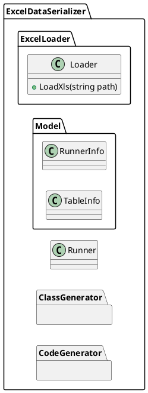

# 클래스 다이어그램
## TODO
### 엑셀 선택
- 개별 시트 추가
- 폴더 추가
- 특수 시트 추가
- 기타 옵션 추가
- 

```plantuml
@startuml
left to right direction
package ExcelDataSerializer {
    class Runner {
    
    }
}
package ExcelDataSerializer.ClassGenerator {
}

package ExcelDataSerializer.CodeGenerator {

}

package ExcelDataSerializer.ExcelLoader {
    class Loader {
        + LoadXls(string path)
    }
}
package ExcelDataSerializer.Model {
    class RunnerInfo {
    
    }
    class TableInfo {
    
    }
}
@enduml
```